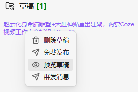
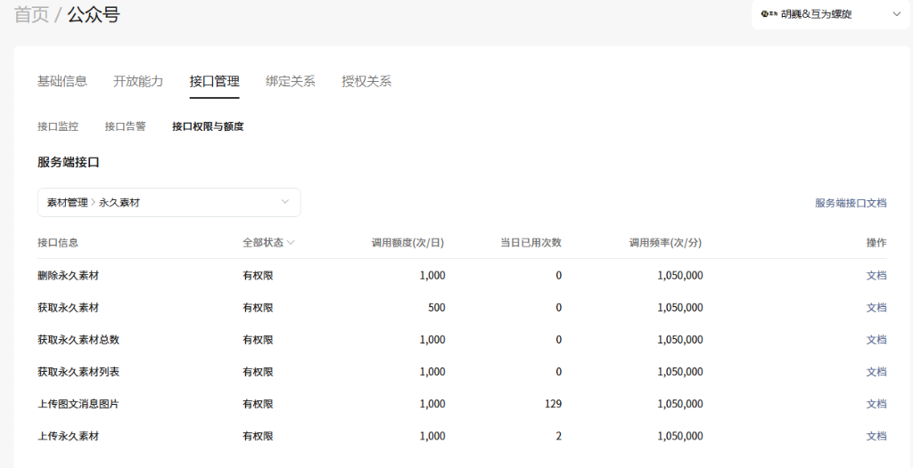

# SmartMP - Obsidian 微信公众号一站式发布工具 🚀

> **SmartMP** 是专为微信公众号创作者打造的 Obsidian 插件，完美集成了本地 Markdown 渲染、AI 智能写作辅助、素材管理与一键发布功能。让您专注于内容创作，剩下的交给我们。

## ✨ 核心特性

### 🎨 极致的排版与预览 (所见即所得)
- **完美还原预览**: 内置微信公众号标准渲染引擎，Obsidian 预览即真机效果。
- **手机模拟器**: 一键切换 Mobile View (375px)，实时检查移动端阅读体验。
- **样式隔离**: 采用 Shadow DOM 技术，确保预览样式不受 Obsidian 主题干扰。
- **实时字数统计**: 预览面板底部实时显示文章字数与预计阅读时间。

### 🤖 AI 智能写作助手 (AI Copilot)
- **爆款标题推荐**: 基于全文内容，AI 技术自动推荐 5-10 个高点击率标题。
- **内容一键润色**: 选中文字即可进行 AI 润色，提升文采与可读性。
- **智能摘要生成**: 快速提炼文章核心点，生成精准的文章摘要。
- **全文智能纠错**: 自动识别错别字、不规范标点及语病。
- **多模型支持**: 已集成 DeepSeek、OpenAI、Ollama 等流行 AI 引擎。

### 🚀 一键发布 (告别手动复制)
- **无缝同步**: 点击“同步至草稿箱”，文章即刻出现在公众号后台，无需复制粘贴。
- **全自动素材管理**:
    - **本地图片**: 自动识别并上传 Obsidian 里的本地图片至微信素材库。
    - **特殊渲染**: 完美支持 **Mermaid** 流程图、**Excalidraw** 手绘图及 **LaTeX** 数学公式，自动转图上传。
    - **SVG 兼容**: 智能处理文章内的 SVG 矢量图，确保移动端显示不丢失。
- **多账号支持**: 轻松管理并切换多个公众号。
- **一键复制 (Clipboard Mode)**:
    - **剪贴板优先**: 点击工具栏“复制”按钮，文章自动转换为富文本格式。
    - **全平台兼容**: 自动将本地图片转为 Base64，完美粘贴至 **Word**、**知乎**、**掘金** 及 **微信后台编辑器**，无需担心图片裂图。
    - **样式保留**: 完整保留当前选用的排版主题与代码高亮样式。

### 📝 微信原生排版增强
- **自动注脚**: 自动将文中超链接提取为文末脚注（[1], [2]...），符合公众号阅读习惯。
- **代码块美化**: 极客风 Mac 风格代码块，支持主流编程语言高亮显示。
- **图片说明 (Caption)**: 自动提取图片 Alt 文本，生成居中的灰色细字说明。
- **约字提示**: 自动在开头嵌入“约 X 字 / 预计阅读 Y 分钟”的优雅提醒。

---

## 🎨 主题模板与定制

SmartMP 提供极高的定制化自由度，每个主题模板本质上是一个包含 CSS 配置的 Markdown 文件。

### 常见内置主题
- **🌟 互为螺旋·金**: 插件主打主题，具有极高的设计感与专业质感。
- **📱 爱范儿 (ifanr)**: 模拟知名科技媒体风格，简约大气。
- **🖌️ 水墨丹青**: 极具意境，适合文学、艺术类图文。
- **🍏 NoteToMP Maple**: 独特的枫叶排版风格。
- **📦 经典集合**: 完美还原 NoteToMP、MWeb 的 30+ 款经典皮肤（如 Dracula, Nord, Vue 等）。

### 主题可定制项
您可以直接修改主题 Markdown 文件中的 CSS 来定制以下内容：
- **全局字体与颜色**: 字体族、字号（建议 15-16px）、行高（建议 1.75）、正文色、链接色等。
- **标题装饰**: 设置标题对齐方式，添加独特的侧边框、下划线或前置装饰符。
- **引用块 (`blockquote`)**: 定制背景色、圆角、阴影及装饰条样式。
- **表格 (`table`)**: 定制表头背景、表头文字、隔行变色样式。
- **代码块与 Callout**: 调整代码高亮配色及各种提示框（Tip, Warning 等）的视觉呈现。

### 🔮 主题克隆 (Theme Cloning)
SmartMP 现已支持从任意微信公众号文章克隆主题！
- **一键提取**: 粘贴文章链接，插件自动分析并提取配色、标题样式、引用块风格等。
- **自动生成**: 提取后自动生成为 SmartMP 主题文件 (`.md`)。
- **即刻应用**: 克隆完成后即可在预览中查看效果，轻松复刻大号排版风格。

## 🧩 功能模块详解

### 1. 核心预览系统 (Previewer)
- **双模式预览**: 支持 **桌面模式** (760px) 与 **移动端模拟** (375px iPhone 标准)，一键切换检查排版。
- **滚动同步**: 基于标题锚点的双向滚动同步算法，写作与预览实时联动。
- **智能素材处理**: 自动上传 Markdown 中的本地图片、Excalidraw 画板、Mermaid 图表至微信服务器。

### 2. 微信集成服务 (WeChat Integration)
- **草稿箱管理**: 支持一键发送文章到草稿箱，并进行预览或群发。
- **素材库视图**: 提供类似文件管理器的左侧面板，可视化管理微信图片、视频与语音素材。
- **IP 白名单**: 自动检测本地 IP 并提示添加到微信后台白名单。

### 3. 数据安全与隐私 (Security)
- **AES-GCM 加密**: 所有敏感信息（AppSecret, API Keys）均使用 **Web Crypto API (AES-GCM 256位)** 加密存储。
- **数据隔离**: 密钥仅保存在本地 `data.json`，绝不上传至任何第三方服务器（除了与对应 AI 服务商通信）。
- **零依赖**: 直接连接微信官方 API，不经过任何中间服务器转发。

---

## 💡 典型使用场景

### 场景 A：高效公众号运营
> **目标**: 每周发布 2-3 篇原创图文。
1. **写作**: 在 Obsidian 中沉浸式撰写 Markdown，使用 `[[链接]]` 引用知识库内容。
2. **预览**: 开启移动端视图，实时检查手机阅读体验。
3. **发布**: 点击"发送到草稿箱"，10秒内完成图片上传与图文同步。

### 场景 B：AI 辅助创作
> **目标**: 快速润色文案并生成标题。
1. **润色**: 选中段落 → `Ctrl+P` → AI 润色，通过流式对话框实时优化文笔。
2. **起名**: 运行 `mp-headline` 命令，AI 自动根据全文生成 10 个爆款标题供选择。
3. **配图**: 使用文生图功能为文章自动生成封面图。

### 场景 C：技术文档分享
> **目标**: 发布包含代码和图表的技术博客。
1. **图表**: 直接使用 **Mermaid** 绘制流程图，插件自动转为高清图片上传。
2. **代码**: 启用 Mac 风格代码块，支持 5 种高亮主题，手机端阅读体验极佳。
3. **公式**: 支持 **LaTeX** 数学公式渲染。

---

## 🆚 为什么选择 SmartMP？

| 功能特性 | SmartMP | 其他方案 |
| :--- | :---: | :---: |
| **移动端模拟预览** | ✅ (375px 像素级还原) | ❌ |
| **AI 深度集成** | ✅ (润色/标题/摘要/生图) | ❌ |
| **可视化素材管理** | ✅ (独立侧边栏视图) | ⚠️ (仅基础上传) |
| **所见即所得主题** | ✅ (11款预设 + CSS自定义) | ⚠️ (样式较少) |
| **多账号管理** | ✅ (一键切换) | ✅ |
| **安全性** | ✅ (AES-256 加密) | ⚠️ (明文或弱加密) |

---

## 🔮 待开发功能 (Roadmap)

### 🛡️ 免配置 IP 白名单中转
**痛点**:
- 用户在家/咖啡馆写作，IP 变动频繁，导致微信 API 调用失败。
- 每次都要登录微信后台 -> 安全中心 -> 修改白名单 -> 等待生效，流程繁琐。

**解决方案 (SmartMP Cloud)**:
- 提供稳定的云端中转服务，彻底解决动态 IP 问题。
- 软件授权升级为**云服务授权**，用户无需任何网络配置，即插即用。

---

---

## 💎 定价方案 (Pricing)

SmartMP 采用 **"本地买断 + 云端订阅"** 的混合模式，兼顾实惠与可持续发展。

### 1. SmartMP Pro (当前推荐)
> **¥69 永久买断** (Early Bird)

适合绝大多数个人创作者，一次付费，永久享受所有本地高级功能。
- ✅ **解锁全部 Pro 功能**:
    - [x] 发布文章**无水印**
    - [x] **主题克隆**: 一键复刻微信公众号文章排版
    - [x] **高级主题**: 解锁所有内置高级渲染模板
    - [x] **优先支持**: 专属微信群技术支持
- ✅ **承诺**: 包含所有未来开发的**本地功能**更新。
- 🎁 **云服务特权**: 未来云服务上线后，Pro 用户首年获赠 3 个月时长。

### 2. SmartMP Cloud (开发中)
> **订阅制** (价格待定，预计 ¥99/年)

为专业团队和多设备用户打造的增值服务。
- ☁️ **免配置 IP 白名单**: 彻底解决动态 IP 导致的 API 失败问题，无需每次登录微信后台改白名单。
- 🔄 **多端同步**: 在多台电脑间同步公众号配置与素材。

---

## 🛠️ 安装指南

### 方式一：社区插件市场 (TBD)
*SmartMP 正在申请上架 Obsidian 社区插件市场，敬请期待。*

### 方式二：手动安装
1. 下载最新发布的 `main.js`, `manifest.json`, `styles.css` 文件。
2. 将文件放入您的 Obsidian 仓库目录：`.obsidian/plugins/smart-mp/`。
3. 重启 Obsidian，在“第三方插件”中启用 **SmartMP**。

## 📋 微信接口权限说明
SmartMP 主要使用以下两类基础权限，个人订阅号通常默认拥有，额度完全满足日常创作需求：

### 1. 草稿箱管理 (核心)
- **新增草稿**: 用于一键发布功能。
- **获取/更新/删除草稿**: 用于素材视图的管理。
- **发布能力**: 插件内置了“群发”与“发布”入口（如下图），方便认证账号直接推送。
- **额度**: 通常为 1000 次/天。
- **⚠️ 内容限制**: 图文消息内容支持 HTML 标签，**必须少于 2 万字符，小于 1MB**。超出限制需手动分割文章或使用「一键复制」功能。

### 2. 素材管理 (图片/封面)
- **上传图文消息图片**: 自动上传文章内的本地图片。
- **上传永久素材**: 上传封面图。
- **额度**: 通常为 1000 次/天（对个人创作者足够）。

> **💡 关于发布权限**: 
> 插件界面中虽然提供了 **“群发消息”** 和 **“免费发布”** 入口，但这些接口需要微信认证（通常仅企业/媒体账号拥有）。
> - **认证账号**: 可直接在插件中点击发布，完成推送。
> - **个人订阅号**: 点击发布会报错（无权限），需登录微信后台手动群发。

## ⚙️ 快速开始

1. **配置公众号**:
   - 进入插件设置 -> **公众号管理**。
   - 添加您的公众号 `AppID` 和 `AppSecret` (需在微信公众平台获取 Developer 权限)。

2. **配置 AI 服务** (可选):
   - 支持 OpenAI / DeepSeek / Ollama 等多种模型。
   - 在 **AI 设置** 中填入 API Key 与 Base URL。

3. **开始创作**:
   - 在 Obsidian 中撰写 Markdown 文章。
   - 打开右侧 **SmartMP 预览面板**，实时查看渲染效果。
   - 点击 **发布草稿**，文章即刻同步至微信后台。

## 🤝 致谢

本项目在 [note-to-mp](https://github.com/sunbooshi/note-to-mp) 与 [obsidian-wechat-public-platform](https://github.com/ai-chen2050/obsidian-wechat-public-platform) 的基础上进行开发。感谢原作者 Learner Chen 与开源社区的贡献。

特别感谢以下开源项目：
- [marked.js](https://marked.js.org/)
- [gray-matter](https://github.com/jonschlinkert/gray-matter)
- [highlight.js](https://highlightjs.org/)
- [MathJax](https://www.mathjax.org/)

## 🔒 隐私声明

SmartMP 尊重您的隐私。以下是本插件的数据处理说明：

- **本地存储**: 所有设置和敏感信息（如 API Key、AppSecret）均加密存储在本地 Obsidian 配置目录中，不会上传至任何第三方服务器。
- **微信 API 调用**: 当您使用"发布草稿"功能时，插件会直接与微信公众平台 API (`api.weixin.qq.com`) 通信，用于上传素材和发布文章。这是核心功能所必需的。
- **AI 服务调用**: 若您启用 AI 功能，插件会将选中的文本发送至您配置的 AI 服务商（如 OpenAI、DeepSeek），用于生成摘要、标题等。**您可以选择不使用此功能**。
- **无后台数据收集**: 本插件不包含任何遥测、广告或用户行为追踪代码。

## 📄 许可证

本项目采用 [MIT License](LICENSE) 许可证。
