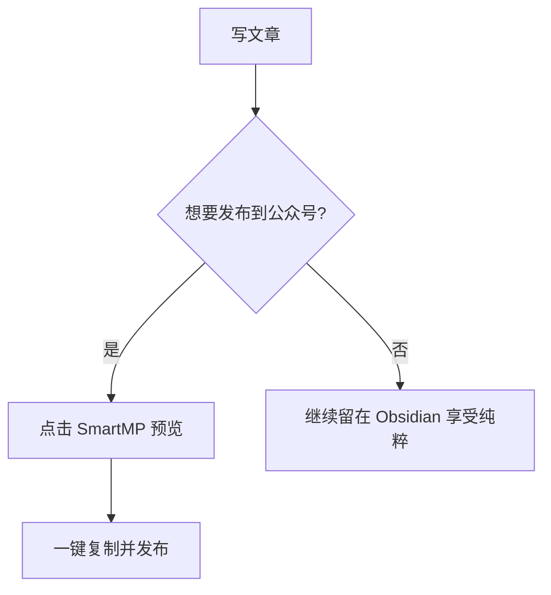

# SmartMP 全功能展示与测试文档

> [!abstract] 简介
> 本文档包含了 SmartMP 插件 README 中提到的所有 Obsidian 特色渲染功能。您可以将其放入 Obsidian 库中，通过 SmartMP 预览面板查看在微信公众号环境下的渲染效果。

---

## 1. 基础 Markdown 渲染
这里测试基础格式：**加粗**、*斜体*、~~删除线~~、`行内代码`、以及[外部链接](https://github.com/LearnerChen/SmartMP)。

---

## 2. 代码高亮 (带 Mac 风格标题)
```typescript
interface SmartMP {
    cool: boolean;
    support: string[];
}

const SmartMP: SmartMP = {
    cool: true,
    support: ["Mermaid", "LaTeX", "Excalidraw"]
};

console.log("SmartMP 让排版变得简单！");
```

---

## 3. Callout & Admonition (Obsidian 原生支持)
> [!info] 这是一个信息提示
> 微信公众号原生不支持这种卡片，SmartMP 将其转换为带图标的漂亮 Section。

> [!warning] 警告 (自定义标题)
> 这是一个测试警告，图标应该是黄色的。

> [!bug] 发现 Bug
> 只要代码逻辑在，Bug 也可以变漂亮。

---

## 4. Mermaid 图表 (自动转图片)


---

## 5. LaTeX 数学公式 (MathJax 渲染)
行内公式测试：$E = mc^2$ 运行正常。

块级公式：
$$
x = \frac{-b \pm \sqrt{b^2 - 4ac}}{2a}
$$
$$\int_{-\infty}^{\infty} e^{-x^2} dx = \sqrt{\pi}$$

---

## 6. 图片说明 (Alt Text 转 Caption)


---

## 7. 链接与脚注转换为微信格式
这是一个带脚注的句子[^1]。

[^1]: 此脚注在 SmartMP 预览中会变成数字上标，并在文末生成“参考链接”列表。

---

## 8. 图标支持 (Icons)
*   Remix Icon: :ri-github-fill: :ri-home-fill: (需安装相关插件支持)
*   Iconize: :lucide-sparkles: :lucide-heart:

---

## 9. Charts 统计图表 (需安装 Obsidian Charts)
```chart
type: bar
labels: [周一, 周二, 周三, 周四, 周五]
series:
  - title: 写作字数
    data: [1200, 1500, 800, 2000, 1700]
```

---

## 10. 嵌套笔记与文档片段
![[MyNoteName#SectionTitle]]
> [!note] 提示
> 此处演示的是 `![[]]` 语法，请确保您的库中存在对应的文件名，SmartMP 会将其递归渲染。

---

## 11. PDF 裁剪 (需 PDF++)
![[document.pdf#page=1&rect=10,20,100,200]]
> SmartMP 会尝试抓取 PDF++ 插件渲染出的裁剪区域。
