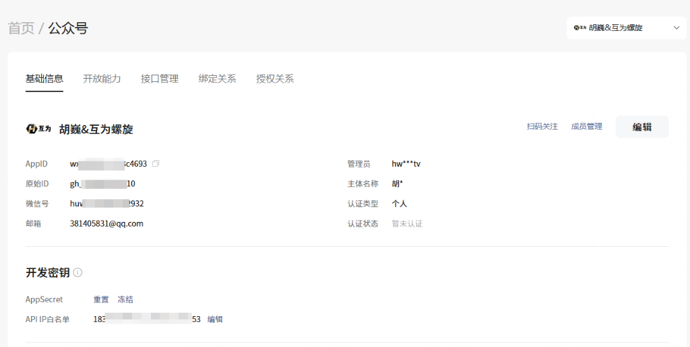
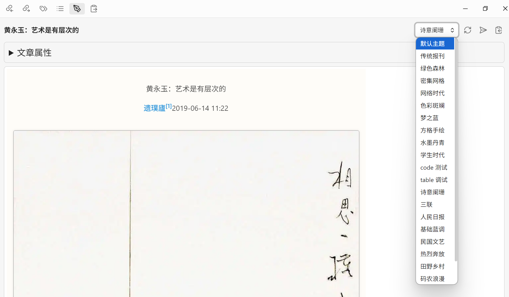
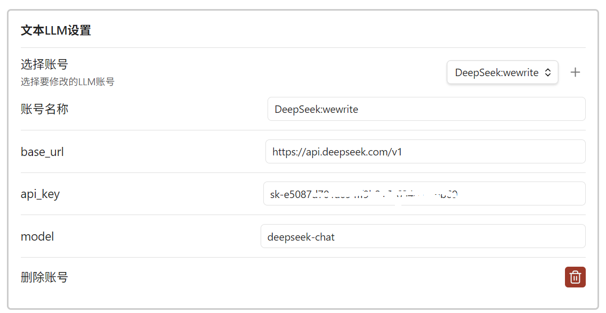
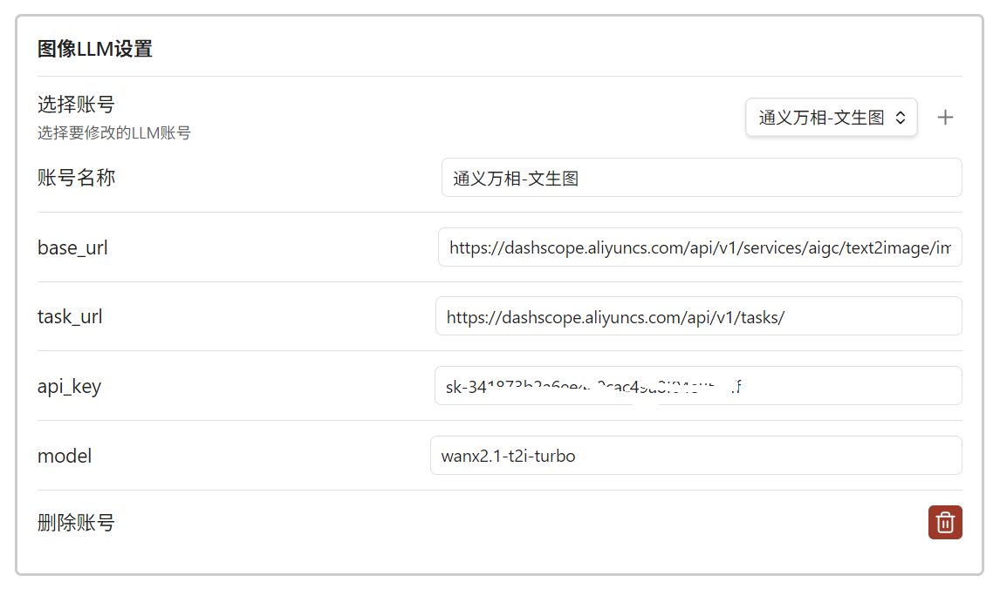

# SmartMP 配置指南

## 📱 公众号账号配置

### 1. 基础信息配置
SmartMP 需要连接到您的微信公众号后台以发布文章。请在微信公众平台 (mp.weixin.qq.com) 获取以下信息填入插件设置：

- **公众号名称**: 用于在插件内区分不同账号。
- **AppID**: 开发 -> 基本配置 -> 公众号开发信息 -> AppID。
- **AppSecret**: 开发 -> 基本配置 -> 公众号开发信息 -> AppSecret。

> **注意**: AppSecret 仅在生成或重置时显示一次，请务必妥善保存。

### 2. IP 白名单配置
微信公众平台要求调用接口的服务器 IP 必须在白名单中。

1. **获取本机公网 IP**: 插件设置页面会自动检测并在 "Current IP" 处显示您的公网 IP。
2. **添加到白名单**:
   - 登录微信公众平台。
   - 开发 -> 基本配置 -> IP白名单 -> 修改。
   - 将插件显示的 IP 地址填入并保存。

## 🎨 主题定制 (Theming)

SmartMP 支持使用自定义 CSS 主题来渲染微信文章。

1. **选择主题**: 在预览面板或设置中选择内置主题。
2. **自定义主题**:
   - 您的自定义主题文件 (`.css` 或 `.md`) 可以存放在 Obsidian 仓库的任意位置。
   - 在设置中指定 **Custom Theme Folder**，插件将自动加载该目录下的所有样式文件。
   - 支持从 GitHub 下载社区贡献的主题模板。

## 🤖 AI 助手配置

SmartMP 集成了强大的 AI 写作辅助功能，支持 OpenAI 兼容接口 (如 DeepSeek, Moonshot/Kimi, 阿里云通义千问等)。

### 文本模型 (Text LLM)
用于**内容润色**、**摘要生成**、**翻译**、**Mermaid 绘图**及**LaTeX 公式生成**。

- **API Key**: 从对应的 AI 服务商获取。
- **Base URL**: 例如 `https://api.deepseek.com/v1`。
- **Model Name**: 例如 `deepseek-chat`。

### 绘图模型 (Image LLM)
用于**文生图** (如生成封面图) 或**文章配图**。

- 支持通义万相 (Wanx), OpenAI DALL-E 3 等模型。

